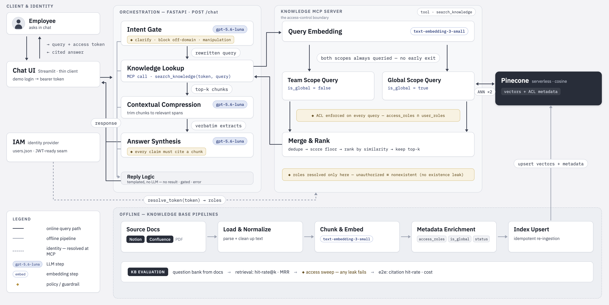

# Internal Knowledge Assistant — Access-Aware RAG over MCP

Secure, role-aware RAG system that answers questions only from authorised document chunks, enforces strict citation, and resists prompt injection at the POC stage.

- **Run it:** see [scaffold/quickstart.md](scaffold/quickstart.md)
- **Full design:** [scaffold/doc/implementation/implementation.md](scaffold/doc/implementation/implementation.md)

## Solution Architecture

## Assumptions

- Documents contain an extractable text layer with headings; image content is represented as text.
- A confidential marker must be present on sensitive information so that it can be chunked and controlled separately.
- Manifest `access` role labels are complete and authoritative (they represent the ACL, not folder names). Document status is updated whenever a new version is inserted. No manifest entry → no ingestion.
- Static token model: `users.json` is the sole identity source of truth.

## Approach

### Offline — Document Ingestion

Pipeline: Source Docs → Load & Normalise → Chunk & Embed → Metadata Enrichment → Index Upsert

**Load & Normalise**
- `pypdf` extracts text per page; NFKC normalisation folds PDF ligatures and collapses whitespace.

**Chunk & Embed**
- Heading-aware splitting that never crosses page boundaries, overlap never crosses a confidential boundary (preserves accurate citation and context safety).
- Chunks are embedded with `text-embedding-3-small`, with default chunk size 125, overlap 10 for more precise search.

**Metadata Enrichment**
- Every chunk carries full document metadata and ACL.
- `is_global=True` is set for unrestricted general files.

### Offline — Evaluation

Pipeline: Question Bank from docs → Retrieval Metrics.

**Question Bank**
- LLM-generated questions per document (committed pool).

**Retrieval Metrics**
- Hit-rate@k, MRR, and an LLM-judged relevancy score (1–5) over the question pool.

### Online — Query Path

Streamlit client (login, chat loop, rendering) → FastAPI → Orchestration layer (sequential pipeline) → MCP Server (tool surface, IAM, dual-scope retrieval, merge & rank, vector store)

**Chat UI — Chat & History**
- Maintains a 6-turn history window.
- Non-domain history is trimmed before the query and history are passed to FastAPI and the orchestrator.

**Intent Gate**
- Single LLM call that classifies the query (clear, unclear, greeting, out-of-domain, manipulation) and rewrites when need.

**Knowledge Lookup**
- One MCP call: `search_knowledge(token, query)`.

**MCP Server — Tool Surface & IAM Boundary**
- Exposes a single tool: `search_knowledge`.
- Performs dual-scope ANN search (team + global) according to the user token, applies the ACL filter (`access_roles ∩ user_roles`), deduplicates by chunk-id, applies a score floor, sorts, and returns the top-k (default is 3) results.

**MCP Server — Vector Store**
- Pinecone chosen for cloud-native scalability and simple API integration.
- Alternatives considered: PostgreSQL (open-source, relational) and Oracle Database (enterprise).

**Contextual Compression**
- Parallel LLM calls, one per retrieved chunk; empty results are dropped.

**Answer Synthesis**
- Single LLM call that produces a tone-controlled answer, flags conflicts, internally inconsistent figures, or stale sources, and requires every claim to cite a chunk.

**Logging**
- Structured, per-request logging of every stage.

## Trade-offs

- **Chunk & Embed** — A section that spans two pages becomes two independent chunks (no cross-page overlap), so some context may be lost. The small embedding model is weaker on niche vocabulary; tables and multi-column layouts remain low-quality.
- **Chat UI** — No streaming → higher perceived latency on long answers.
- **Intent Gate** — May fail on domain-specific abbreviations; misclassification can block legitimate queries.
- **Knowledge Lookup** — Stdio subprocess started per request introduces startup latency.
- **Merge & Rank** — Two vector searches are executed on every request.
- **Contextual Compression** — Extra cost and latency.
- **Answer Synthesis** — Prioritises precision over helpfulness when evidence is thin.
- **Evaluation** - Questions are LLM-generated without human gate.

## Future Potentialss

- **Source Docs** — Knowledge-base management service for adding new documents.
- **Load & Normalise** — Additional loaders (docx, xlsx, markdown) and a vision model for images.
- **Chunk & Embed** — Manual chunking support; hybrid dense + sparse retrieval for exact-keyword recall.
- **Index Upsert** — Switch to HNSW-based indexing when scale or cost requires it.
- **Intent Gate** — Domain library to improve intention understanding.
- **Knowledge Lookup** — Persistent MCP session to eliminate per-request startup cost.
- **Query Path** — Signed-JWT validation in transport headers; HyDE for query expansion.
- **Contextual Compression** — Add a re-ranker and MMR diversity when top-k results are weak.
- **Answer Synthesis** — Generate relevant follow-up questions; add an output validator against prompt injection and jailbreaks.
- **Logging** — Integrate MLflow for experiment tracking, run comparison, and artefact storage.
- **Evaluation** - Golden question provided from business stakeholders, generate with security-focused questions.
- **Design** - Split Frontend UI, API Gateway, Conversation, Orchestrator, Knowledge MCP, Evaluation and KB service as seperate micro services for long term scalability. 